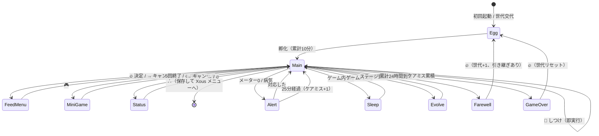

# 画面デザイン・遷移・ボタン割り当て（モック）

対象: 128 × 128 モノクロ OLED（1bpp）

> モック中の絵文字のうち、**メニューバーのアイコンは実物**。`emoji` フォント（16×16、1bpp）が
> イメージに含まれており、`🍚 🎮 🧹 💊 📖` はいずれも収録済みなのでそのまま描画できる。
> キャラクターの顔文字は説明用で、実装は円と線で描いている（将来ビットマップに置き換え）。

> **表示文字列について**: 日本語表示には **`xous-core` の fork が必要**。
> 上流の `blitstr2` は、baosec イメージに焼いた `ja` フォントに到達できない。
> `english_rules` が baosec 向けビルドで `zh` にしかフォールバックせず
> （`libs/blitstr2/src/style_macros.rs`）、`locales/lang-ja` を有効にしても
> `style_glyph()` がロケールを `"jp"` と比較する一方 `locales` が返すのは `"ja"` なので
> 一致しない（`libs/blitstr2/src/lib.rs`）。
> 修正は `threepipes/xous-core` の `fix/baosec-cjk-fallback` ブランチにある。
> 素の `xous-core` でビルドすると、かなはすべて U+FFFD になる。

---

## 1. 入力

`services/bao1x-hal-service/src/servers/keyboard.rs` の `map_keypress()` が、
物理入力を以下の文字にマップしている。

| キーコード | 物理入力 | 位置 |
|---|---|---|
| `←` | `KeyPress::Left` | **左ボタン** |
| `🔥` | `KeyPress::Center` | **中央ボタン** |
| `→` | `KeyPress::Right` | **右ボタン** |
| `↑` `↓` | `KeyPress::Up` / `Down` | ジョグ（別位置） |
| `∴` | `KeyPress::Select` | ジョグ押し込み（別位置） |

`🔥` は "Fire" の意。ソースのコメントによれば、キャリッジリターン（`\r`）が
シェルの行末に予約されているため、中央キーには専用の文字が割り当てられている。

`dc34-vault` でも `←` `→` `🔥` の3つを一組として扱う判定があり（`ux.rs:286`）、
この3つが横並びの3ボタンであることを裏付けている。

### 画面上の表記

キーコードそのものは画面に出さない。`🔥` は炎に見えて「中央ボタン」と読めず、
`←` `→` も 16px の全角グリフで幅を食うため。

| ボタン | 画面表記 |
|---|---|
| 左 | `<` |
| 中央 | `o` |
| 右 | `>` |

いずれも base フォントの半角文字なので幅が小さい。
全角グリフは幅 16px + カーニング 1px で **1行に7文字しか入らない**ので、
説明文はこの制約の中に収める必要がある。

### 割り当て

**上下キー（`↑` `↓`）は使わない。** ゲーム内の操作は前面3ボタンで完結させる。

| ボタン | キーコード | 役割 |
|---|---|---|
| **左** | `←` | **選択** — カーソルを1つ進める（右端で左端へ循環） |
| **中央** | `🔥` | **決定** — 選択中の項目を実行 |
| **右** | `→` | **キャンセル** — 戻る / 選択解除 |
| ジョグ押し込み | `∴` | **ゲームを抜ける** — バッジのメニューへ |

`∴` だけは例外的に使う。当初はメイン画面で `→` を押したときに抜ける設計だったが、
**誤操作で頻繁に抜けてしまう**ため変更した。`∴` は前面3ボタンから離れた位置にあり、
公式アプリでもメニューキーとして使われているので、役割としても一貫する。

`→` はゲーム内で「戻る」以上のことをしない。

> **補足**: 左ボタンでカーソルが右に進むので、物理配置と移動方向は逆になる。
> 3 ボタンで選択・決定・キャンセルを賄うには、選択ボタンを一方向の送りにするのが素直。
> 違和感が強い場合は、
> 「`←` `→` で双方向移動、キャンセルは中央長押し」に変更する余地がある。
> ただし長押し判定が必要になるため、まずは循環方式で試す。

---

## 2. 画面レイアウト

縦 128px を 3 段に分ける。

```
        0 ┌──────────────────────────────┐
          │  ステータスバー (16px)        │   世代・日数・ごきげん・空腹
       16 ├──────────────────────────────┤
          │                              │
          │                              │
          │   キャラクター領域 (96px)     │   キャラ・うんち・アニメーション
          │                              │
          │                              │
      110 ├──────────────────────────────┤
          │  メニューバー (18px)          │   アイコン5個、選択中は反転
      128 └──────────────────────────────┘
```

キャラ領域は 128 × 94。ドット絵に十分な余裕があり、表情や動きで状態を表現できる。

メニューバーが 18px なのは、絵文字・日本語のグリフが 16px 固定で、
上下 1px のマージンを足すと 18px になるため。

キャラ領域の最下段 18px は**「困りごと」の行**として空けておく。
左に 💩 を最大4つ、右端に 🤒（病気）または ❗（呼び出し）を置く。

---

## 3. 各画面

### 3.1 メイン画面（アイドル）

常態。キャラが歩き回り、うんちが溜まる。

```
┌──────────────────────────────┐
│ G3  D4      ♥♥♡♡   ▮▮▮▯      │
├──────────────────────────────┤
│                              │
│           ( ˘ ω ˘ )          │
│            /|   |\           │
│           ~        💩        │
│                              │
├──────────────────────────────┤
│ [🍚] 🎮  🧹  💊  📖          │
└──────────────────────────────┘
```

- `G3` = 第3世代、`D4` = ゲーム内4日目
- `♥` = ごきげん（4段階）、`▮` = 満腹度（4段階）
- 選択中のアイコンは白黒反転。**常にどれか1つが選択されている**

| ボタン | 動作 |
|---|---|
| `<` 左 | カーソルを1つ右へ（循環） |
| `o` 中央 | 選択中のメニューを実行 |
| `>` 右 | **ステータス画面へ** |

アイコンが絵文字になったので、**選択中の項目名は表示しない**。
その位置は「困りごと」の行と重なるうえ、🍚 や 💊 に説明は要らない。

メイン画面には「戻る」対象が無いので、`→` をステータス画面に充てている。
サブメニューを1つ潰せるうえ、一番よく見る情報に1操作で辿り着く。

### 3.2 メニュー項目

| アイコン | 名前 | 動作 |
|---|---|---|
| 🍚 | ごはん | サブメニュー（ごはん / おやつ）へ |
| 🎮 | あそぶ | ミニゲームへ |
| 🧹 | そうじ | うんちを消す。即実行 |
| 💊 | くすり | 病気を治す。病気でなければ「げんき！」表示 |
| 📖 | しつけ | 呼び出し中なら叱る。そうでなければ無反応（＝ミス扱いにしない） |

**⚙ サブメニューは持たない**。中身の3項目はそれぞれボタンか自動処理に移した。

| 元の項目 | 移動先 |
|---|---|
| ステータス | メイン画面で `→` |
| セーブ | 自動（状態変化時とディープスリープ突入前） |
| おわる | `∴`（ジョグ押し込み） |

セーブを明示的に置いていたのは「USB を抜く前に自分で保存できる」安心感のためだったが、
`∴` で抜けるときにも保存すれば同じことなので、項目としては不要になった。

### 3.3 ごはんサブメニュー

```
┌──────────────────────────────┐
│ G3  D4      ♥♥♡♡   ▮▮▮▯      │
├──────────────────────────────┤
│                              │
│      ┌────────────────┐      │
│      │ ▶ ごはん        │      │
│      │   おやつ        │      │
│      └────────────────┘      │
│                              │
├──────────────────────────────┤
│           > でもどる         │
└──────────────────────────────┘
```

- ごはん = 満腹度 +1、体重 +1
- おやつ = ごきげん +1、体重 +2

| ボタン | 動作 |
|---|---|
| `<` 左 | 項目を1つ下へ（循環） |
| `o` 中央 | 実行 → アニメーション → メイン画面 |
| `>` 右 | メイン画面へ戻る |

画面下の説明は `> でもどる` だけ。3つ並べると 128px に収まらないので、
**各画面で一番分かりにくい1つ**だけを出す方針にしている。

### 3.4 ⚙ サブメニュー — 廃止

かつてここに「ステータス / セーブ / おわる」を置いていたが、**画面ごと無くした**。
移動先は §3.2 の表を参照。

サブメニューが1階層減り、メイン画面のアイコンも6個から5個になった。
`∴` を使うのは、当初「3ボタンで完結させる」方針から外れるが、
公式アプリ（`dc34-vault`）でも `∴` が「メニューを開く」役割を持っている（`main.rs:395`）ので、
他アプリとの一貫性はむしろ高い。

### 3.5 ミニゲーム（左右あて）

キャラがどちらを向くかを当てる。

```
┌──────────────────────────────┐
│      あっちむいて            │
│      ホイ                    │
│  ひだり？みぎ？               │
│                              │
│  👈     ( ˘ ω ˘ )      👉    │
│                              │
│  2/5           o やめる      │
└──────────────────────────────┘
```

- 5 回勝負。3 回以上当てるとごきげん +2、体重 -1
- 負け越したらごきげん +1、体重 -1

| ボタン | 動作 |
|---|---|
| `<` 左 | **ひだり** と答える（押した時点で1回分が確定） |
| `o` 中央 | **中断**してメイン画面へ |
| `>` 右 | **みぎ** と答える（押した時点で1回分が確定） |

**この画面だけ3ボタンすべての意味が変わる**。左右を指すことがゲームそのものなので、
選択してから決定する、という間接操作を挟まない。
押した側がそのまま答えになるので、決定ボタンは空く。そこに中断を置いている。

### 3.6 ステータス画面

メイン画面で `→` を押すと出る。

```
┌──────────────────────────────┐
│          ステータス           │
├──────────────────────────────┤
│  なまえ   ハムりん           │
│  せだい   3                  │
│  ねんれい 4にち              │
│  たいじゅう 25g              │
│  しつけ   ▮▮▮▯               │
│  ケアミス 2かい              │
├──────────────────────────────┤
│         > でもどる           │
└──────────────────────────────┘
```

| ボタン | 動作 |
|---|---|
| `>` キャンセル / `o` 決定 | メイン画面へ戻る |

### 3.7 睡眠中

ゲーム内 0〜4 時（累計稼働 20 分）。

```
┌──────────────────────────────┐
│ G3  D4                       │
├──────────────────────────────┤
│                              │
│              z z             │
│         ( ─ ω ─ )            │
│                              │
│                              │
├──────────────────────────────┤
│         おやすみ…            │
└──────────────────────────────┘
```

- **世話の操作は受け付けない**（メニューバーも消す）。
  ただし `→` でのステータス表示は有効。見るだけなので寝ている個体に影響しない
- サブメニュー表示中に夜になったら、メイン画面に戻す。
  そのまま置くと、そのサブメニューが待っているボタンを全部無視することになり操作不能になる
- 「就寝中に消灯しないとケアミス」という判定は**採用しない**。
  絶対時刻を持たず、電源が落ちている間は進行も止まる設計なので、
  プレイヤーが消灯できたかどうかを公平に判定できない

### 3.8 呼び出し（アラート）

空腹・ごきげんが 0 になった、または病気になったとき。

```
┌──────────────────────────────┐
│ G3  D4      ♡♡♡♡   ▯▯▯▯      │
├──────────────────────────────┤
│                              │
│         ( >  <  )            │
│          /|   |\             │
│                              │
│  💩 💩                   ❗  │
├──────────────────────────────┤
│ [🍚] 🎮  🧹  💊  📖          │
└──────────────────────────────┘
```

- メイン画面のバリエーション。キャラが困り顔になり、右下に ❗ が出る
- **病気のときは 🤒**。困り顔だけでは「おなかが空いている」のか
  「病気」のか区別がつかず、必要な操作（ごはん / くすり）を選べなかった
- **25 分以内**に対応しないとケアミス 1 回
- 音も LED も無いので、**気づけるのは画面を見たときだけ**。
  USB 給電で机上に置く運用のため、仕様として受け入れる

### 3.9 進化

```
┌──────────────────────────────┐
│                              │
│         おおきくなった！      │
│                              │
│         ( ^ ω ^ )            │
│          /|   |\             │
│                              │
│                              │
├──────────────────────────────┤
│        o でつづける          │
└──────────────────────────────┘
```

### 3.10 寿命 → 世代交代

累計稼働 24 時間を生き切った場合。

```
┌──────────────────────────────┐
│                              │
│  じゅみょうをまっとうしました  │
│                              │
│        ( - ω - )  ✧          │
│                              │
│    せだい 3 → 4              │
│    とくせい をひきついだ      │
│                              │
├──────────────────────────────┤
│        o でつづける          │
└──────────────────────────────┘
```

`o` で **卵画面へ**。世代番号 +1、育て方に応じた特性を引き継ぐ。

### 3.11 早死に → ゲームオーバー

ケアミスの累積で死んだ場合。

```
┌──────────────────────────────┐
│                              │
│                              │
│         ( x  x )             │
│                              │
│      おわってしまった…       │
│                              │
│    せだい 3 → 1              │
│                              │
├──────────────────────────────┤
│      o ではじめから          │
└──────────────────────────────┘
```

`o` で **卵画面へ**。世代番号はリセット、引き継ぎ無し。

### 3.12 卵（開始）

```
┌──────────────────────────────┐
│ G1  D0                       │
├──────────────────────────────┤
│                              │
│            ___               │
│           /   \              │
│          |  ~  |             │
│           \___/              │
│                              │
├──────────────────────────────┤
│      うまれるまで…           │
└──────────────────────────────┘
```

累計稼働 10 分で孵化 → 赤ちゃんへ。この間もメニューバーは出さない。

---

## 4. 画面遷移



---

## 5. ボタン割り当て一覧

| 画面 | `←` 選択 | `🔥` 決定 | `→` キャンセル | `∴` |
|---|---|---|---|---|
| メイン | カーソル送り | 実行 | **ステータスへ** | ゲームを抜ける |
| ごはんメニュー | 項目送り | 実行 | メインへ戻る | ゲームを抜ける |
| ミニゲーム | **ひだり** | **中断** | **みぎ** | ゲームを抜ける |
| ステータス | — | 戻る | 戻る | ゲームを抜ける |
| 睡眠中 | — | — | **ステータスへ** | ゲームを抜ける |
| 進化 / 寿命 / 終了 | — | つづける | — | ゲームを抜ける |
| 卵 | — | — | — | ゲームを抜ける |

**原則**: `🔥` は「進む・決定」、`→` は「戻る」、`←` は「選ぶ」、
`∴` は常に「ゲームを抜ける」。`↑` `↓` は未使用。

例外は2つ。メイン画面の `→` は戻る先が無いのでステータス画面に充てている。
ミニゲームは3ボタンすべてが専用の意味を持つ（§3.5）。

睡眠中も `∴` は受け付ける。抜けられなくなる方が実害が大きい。

---

## 6. 実装メモ

- ステータスバーとメニューバーは共通コンポーネントにして、全画面で使い回す
- キャラの表情は「通常 / 困り / 喜び / 病気 / 睡眠 / 死亡」の 6 種類あれば足りる。
  1 枚 96×96 の 1bpp ビットマップで 1152 バイト、6 枚で約 7 KB
- 画面の再描画は状態変化時のみ。`dc34-vault` の `redraw()` が
  「前回のモードと違うときだけ描く」構造になっているので、それに倣う
- ミニゲームの乱数は TRNG が使える（`bao1x-emu` に hosted 用シムもある）
- `↑` `↓` `∴` は受け取っても無視する。
  ただし `∴` は公式アプリでメニューキーとして使われているため、
  将来的に「おわる」を割り当てる余地は残しておく
